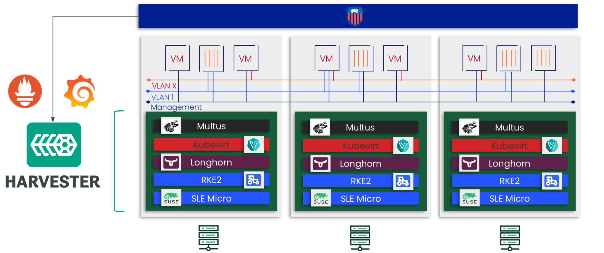
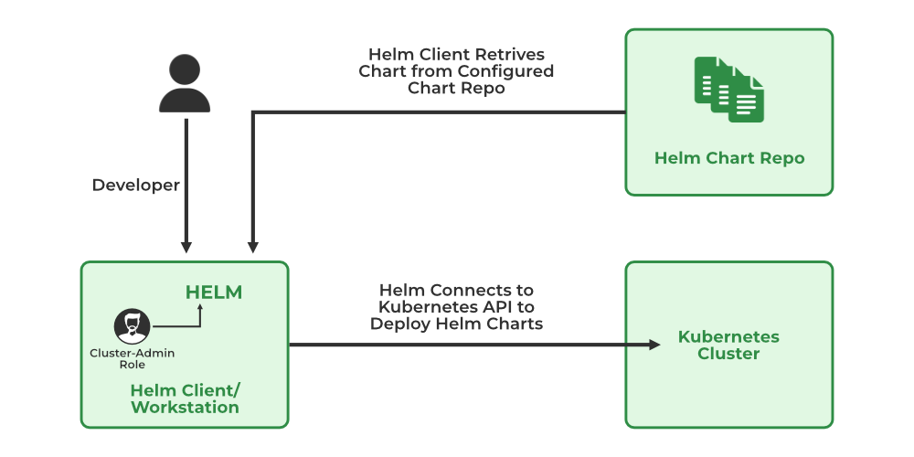
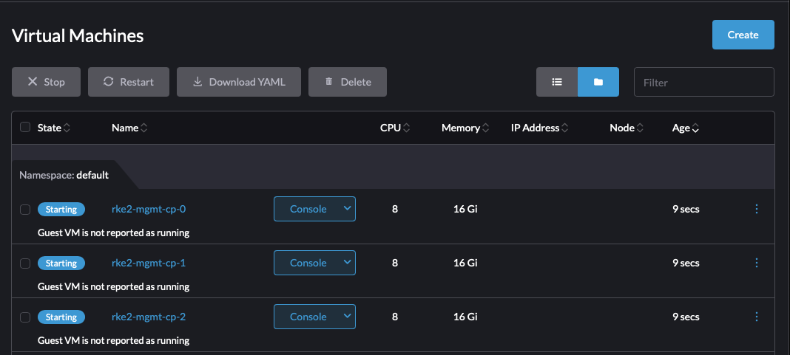
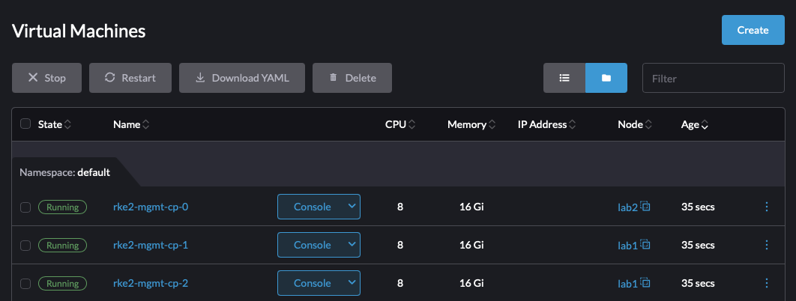
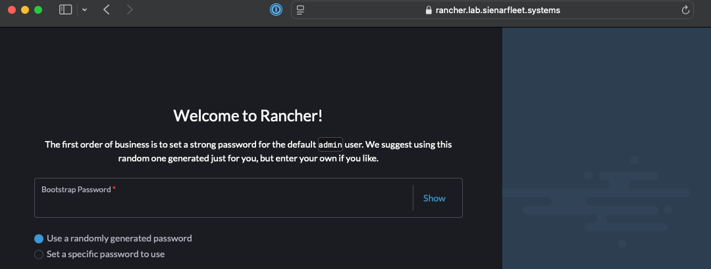
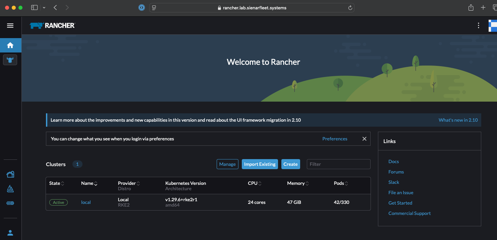
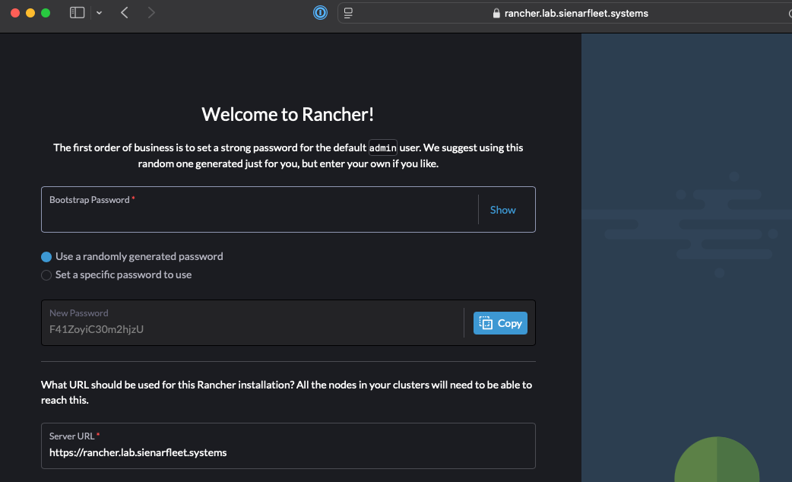
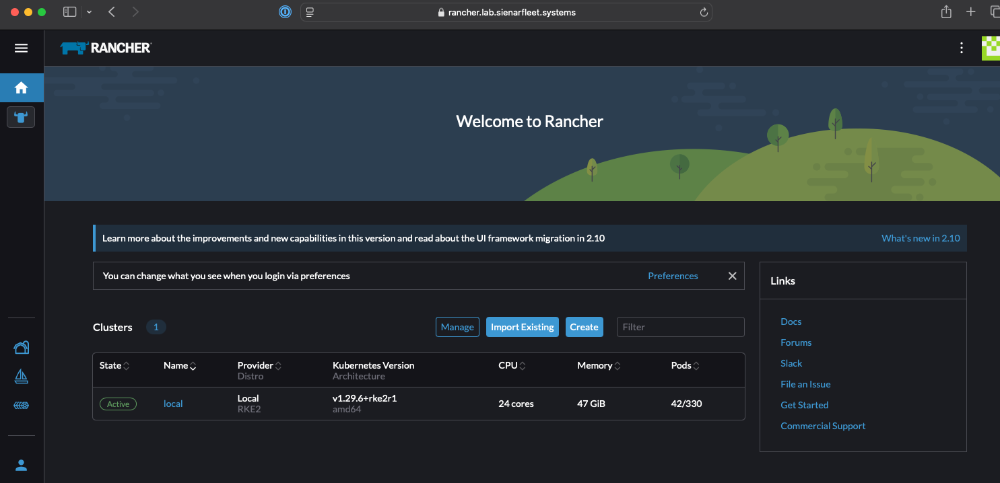

# Three Easy-mode ways of Installing Rancher onto Harvester

## Intro
Greetings! We are here to dive into Rancher's Harvester product and explore some of the synergies that emerge when we combine the infrastructure and orchestration layers using a unified API. That unified API is the Kubernetes API. So, instead of using the usual cloud-native tools in our toolbox (Terraform, Ansible, etc), we are going to try to use ONLY Kubernetes to deploy a guest RKE2 cluster onto Harvester and then install Rancher Multi-cluster Manager on that cluster. Ideally we do this with minimal steps and avoid usage of complex bash scripts.

I'm going to take a few extra minutes to explain HOW we take a base VM we would use for an RKE2 node and turning it into a Helmchart. I don't want to bog anything down so I'm sticking it in a separate doc that I will link below.

### Table of Contents

* Kubernetes CRDs and Harvester
* Helm Templating
* A Simple Helmchart for Harvester
* Installing Rancher Method 1 (Helm)

### Dependencies
There will be minimal dependencies here but the most notable one that you'll need in order to reproduce this demonstration is a running Harvester instance. Harvester can run on nearly anything. [Hop over to github](https://github.com/harvester/harvester/releases/tag/v1.4.0) and grab the iso if you haven't installed it yet.

Within Harvester, you'll need a VM Network that is routable within your network and a base vm image already preloaded.

## Kubernetes CRDs and Harvester

The true power of Kubernetes is not just being able to run containers. Its true power lay in HOW it runs containers. All resources in Kubernetes are defined using a common API. And the controllers, schedulers, etc all operate with objects defined by those APIs via abstraction.

These APIs are extensible via `CRDs` or `CustomResourceDefinitions`. This allows vendors, like Rancher, to create specific objects for their application within Kubernetes. Using these objects and APIs, an operator can also work with the application using various forms of automation and templating. 

In the end, Kubernetes' true power is how everything that it runs and controls is infrastructure-as-code or configuration-as-code. Harvester is a combination of Kubernetes products and relies on the unified APIs to manage everything it controls. This allows us to do all sorts of VERY cool things that we cannot do within VMware, Nutanix, or OpenStack!



## Helm Templating

Because everything can be defined by simple `yaml` or `json` configuration in Kubernetes, we can use various templating technologies in order to build more complex applications and only expose the config values we want. 

When defining a full configuration for an application, there will be a lot of data going into those configurations that you might want to hide away from the consumer of your template. You might even want to be able to generate more complex configurations based on small input data. To do this, we can use templating technologies.



This is where Helm comes in (and tools similar to it) in that it wraps `go-templating` up in a package with some other options and allows you to templatize a complex application configuration.

To take a deeper look at Helm, go checkout the [Helm webpage](https://helm.sh) that has a lot of good information for starters. And then with google or ChatGPT you can find many good examples out there of more complex helmcharts.

## A Simple Helmchart for Harvester
Because this topic will go in-depth, I'm going to put it here: [Basic Helmchart for Harvester](harvester_helmchart.md)

## Installing Rancher Method 1 (Helm)

Using the above-mentioned Helm path, I've written a (very) basic helmchart that will allow me to describe an RKE2 cluster with a set amount of nodes along with other configurables that go into it (like the static manifests we use to auto-install Rancher). Note that this is simple on-purpose because I could add in all kinds of features if I wanted but creating a feature-complete Helmchart is not useful for me here as that's not what I'm trying to illustrate.

### Preconfig Requirements

Currently, Harvster's loadbalancer works well but has a very prescriptive `ValidatingWebhook` that breaks different cloud patterns of LoadBalancer management. That issue is being rectified in 1.4.x, but it is easy to remove the webhook for the LoadBalancer using the command below:

```bash
kubectl delete ValidatingWebhookConfigurations harvester-load-balancer-webhook
```

### Configuration

I have hosted that helm chart [here](helm/rke2/) and included a [demo values file](helm/demo_values.yaml) that includes a few things we haven't discussed here. I have embedded the `Cert-Manager` and `Rancher` Helmchart CRDs here as static manifests. This is a simple solution to ensuring these helmcharts are installed as soon as RKE2 enters a `Ready` state. Feel free to edit this file to tailor to your own environment. 

Some notes on what to edit:
* LoadBalancer values (`control_plane.loadbalancer_gateway` `control_plane.loadbalancer_subnet` `control_plane.vip`) -- ensure your LB IP settings are on the host/mgmt network for now unless you want to add extra routing rules
* Static IP Network Config (`control_plane.network`) -- note this is an Ubuntu example, Rocky and RHEL look a little different
* SSH public key (`ssh_pub_key`) -- Ensure you have ownership of the key pair, we'll need it to hop onto the node if something goes wrong
* VM specs (`control_plane.cpu_count` `control_plane.memory_gb`)
* Network Name (`network_name`) -- the VM Network you created in Harvester that will host your VMs
* VM Image Name (`vm.image`) -- the name of the VM image you're using for your nodes.
* Rancher URL (`control_plane.files[].content`)-- set the embedded rancher URL to a domain you control or at least one you can set in your local `/etc/hosts`


## Installation

Once we have a good config, let's apply this helmchart to our Harvester cluster!

```console
❯ helm install rke2-mgmt -f demo_values.yaml rke2/
NAME: rke2-mgmt
LAST DEPLOYED: Fri Jan 10 14:08:05 2025
NAMESPACE: default
STATUS: deployed
REVISION: 1
TEST SUITE: None
```

I can immediately look at my Harvester UI and see 3 VMs starting!


A few seconds later, Harvester has assigned those VMs to different nodes and the VMs are now booting.



## Validation 

Once I give it a minute or two, I can use my SSH key to query the cloud-init state and see when RKE2 will be available:
```bash
export SSH_PRIVATE_KEY=$HOME/.ssh/infrakey
export RKE2_NODE_IP=10.2.0.21
ssh -i $SSH_PRIVATE_KEY -o UserKnownHostsFile=/dev/null -o StrictHostKeyChecking=no ubuntu@$RKE2_NODE_IP "while [ ! -f /var/lib/cloud/instance/boot-finished ]; do echo 'Waiting for Cloud-Init...'; sleep 5; done"
```

Once I know RKE2 is up, I can use a similar command to grab my kubeconfig off the node and modify it with the VIP value:
```bash
export SSH_PRIVATE_KEY=$HOME/.ssh/infrakey
export RKE2_NODE_IP=10.2.0.21
export VIP=$(helm get values rke2-mgmt | grep vip: | awk '{printf $2}')
ssh -i $SSH_PRIVATE_KEY -o UserKnownHostsFile=/dev/null -o StrictHostKeyChecking=no ubuntu@$RKE2_NODE_IP "sudo cat /etc/rancher/rke2/rke2.yaml" 2> /dev/null | \
sed "s/127.0.0.1/${VIP}/g" > kube.yaml
chmod 600 kube.yaml
```

I check the node state here:
```console
❯ kubectl --kubeconfig kube.yaml get nodes
NAME             STATUS   ROLES                       AGE   VERSION
rke2-mgmt-cp-0   Ready    control-plane,etcd,master   11m   v1.29.6+rke2r1
rke2-mgmt-cp-1   Ready    control-plane,etcd,master   10m   v1.29.6+rke2r1
rke2-mgmt-cp-2   Ready    control-plane,etcd,master   10m   v1.29.6+rke2r1
```

Now I check Rancher's state and see that it is running!
```console
❯ kubectl --kubeconfig kube.yaml get po -n cattle-system
NAME                                         READY   STATUS      RESTARTS        AGE
helm-operation-bxftn                         0/2     Completed   0               8m13s
helm-operation-hrwgj                         0/2     Completed   0               8m38s
helm-operation-l87jh                         0/2     Completed   0               7m35s
helm-operation-lrpnt                         0/2     Completed   0               9m10s
helm-operation-mk6zt                         0/2     Completed   0               8m2s
helm-operation-sjvb4                         0/2     Completed   0               7m25s
helm-operation-vnrhf                         0/2     Completed   0               7m5s
helm-operation-xxqgl                         0/2     Completed   0               8m19s
rancher-7d8f64bfc6-8v4wx                     1/1     Running     1 (9m56s ago)   10m
rancher-7d8f64bfc6-rzqnb                     1/1     Running     1 (9m56s ago)   10m
rancher-7d8f64bfc6-z2h6v                     1/1     Running     0               10m
rancher-webhook-bfd464697-rk7dh              1/1     Running     0               7m59s
system-upgrade-controller-646f9548cc-pkzvk   1/1     Running     0               7m32s
```

I verify Rancher is up by going to the UI. I configured my URL to be `rancher.lab.sienarfleet.systems`. If I did not have control over my DNS, I would need to make an entry in `/etc/hosts` on my MacBook. But I'm good. So opening the browser reveals the running rancher instance:


I set my bootstrap password to `admin` when I setup my helm values, so I add that and sign-in. I then see the Rancher UI for 2.10.1! I've now successfully installed Rancher on a guest RKE2 cluster using a simple helmchart!


## Installing Rancher Method 2 (Fleet)
This method is new and takes advantage of the new Fleet integration with Harvester. We'll be using the HelmChart we used from the [Method 1]() section here  here. There are two ways to do this, one requires having a git repo available within your envionment (or from the internet if you have access) and the other doesn't require git. 

Creating the second version is a bit tedious unless you can create the first version. The reason for this is because the first version uses Fleet's GitOps capability by referencing a remote git repo that contains both the RKE2 helmchart and values. When consumed by `Fleet` this data creates a `Bundle` object inside of Harvester/Fleet. Fleet uses Bundle objects to do automation work as a Bundle describes a set of discovered resources and how to process them. The second method here uses a `Bundle` directly and creating them can be a little toilsome.

To avoid that issue, I'm including a prebuilt one that contains the helmchart in its current state as of Jan 8th 2025. The `Bundle` file is the [Management Cluster config](./fleet/mgmt.yaml) file. 

In a real production environment, we would likely opt for the first version using a true GitOps approach to managing this cluster. But now for simplicity, we'll just use the Bundle.

### Preconfig Requirements

Currently, Harvster's loadbalancer works well but has a very prescriptive `ValidatingWebhook` that breaks different cloud patterns of LoadBalancer management. That issue is being rectified in 1.4.x, but it is easy to remove the webhook for the LoadBalancer using the command below:

```bash
kubectl delete ValidatingWebhookConfigurations harvester-load-balancer-webhook
```

### Configuration
Edit the [Management Cluster config](./fleet/mgmt.yaml) file and set all values appropriately. Note here, unlike the pure helm version, we need to inject some values ourselves into the Bundle CRD. The values we are editing reside in the yaml path `.spec.helm.values`.

Ensure these are set correctly:
* LoadBalancer values (`control_plane.loadbalancer_gateway` `control_plane.loadbalancer_subnet` `control_plane.vip`) -- ensure your LB IP settings are on the host/mgmt network for now unless you want to add extra routing rules
* Static IP Network Config (`control_plane.network`) -- note this is an Ubuntu example, Rocky and RHEL look a little different
* SSH public key (`ssh_pub_key`) -- Ensure you have ownership of the key pair, we'll need it to hop onto the node if something goes wrong
* VM specs (`control_plane.cpu_count` `control_plane.memory_gb`)
* Network Name (`network_name`) -- the VM Network you created in Harvester that will host your VMs
* VM Image Name (`vm.image`) -- the name of the VM image you're using for your nodes.
* Rancher URL (`control_plane.files[].content`)-- set the embedded rancher URL to a domain you control or at least one you can set in your local `/etc/hosts`

### Installation

Installation is EASY. Just point your kube context to your Harvester cluster and fire away!
```bash
kubectl apply -f fleet/mgmt.yaml
```

Once the `Bundle` is created in Harvester, Fleet will immediately begin trying to install the embedded HelmChart. You should quickly see VMs start spinning up in Harvester, assuming your config values were correct.

### Validation

Once helm has installed the release that creates the RKE2 cluster, you can wait for the first node to come online (it waits for cloud-init). Set the env vars correctly.
```bash
export SSH_PRIVATE_KEY=$HOME/.ssh/infrakey
export RKE2_NODE_IP=10.2.0.21
ssh -i $SSH_PRIVATE_KEY -o UserKnownHostsFile=/dev/null -o StrictHostKeyChecking=no ubuntu@$RKE2_NODE_IP "while [ ! -f /var/lib/cloud/instance/boot-finished ]; do echo 'Waiting for Cloud-Init...'; sleep 5; done"
```

So the install process goes like this: RKE2 -> Cert-manager -> Rancher. On my system, this takes about 7min to install in total and I am not doing any airgap stuff. When airgapping everything, it is significantly faster (5min or less).

If you want to peek at progress, you can use the kubeconfig of the cluster once it is up to watch for Rancher starting. After Rancher has started, congrats, you're done!

Once the first node is in a ready state, you can fetch the kubeconfig from the node using the below command and set the VIP value inside it. Set the env vars correctly.
```bash
export SSH_PRIVATE_KEY=$HOME/.ssh/infrakey
export RKE2_NODE_IP=10.2.0.21
export VIP=$(helm get values mgmt-cluster | grep vip: | awk '{printf $2}')
ssh -i $SSH_PRIVATE_KEY -o UserKnownHostsFile=/dev/null -o StrictHostKeyChecking=no ubuntu@$RKE2_NODE_IP "sudo cat /etc/rancher/rke2/rke2.yaml" 2> /dev/null | \
sed "s/127.0.0.1/${VIP}/g" > kube.yaml
chmod 600 kube.yaml
```

I check the node state here:
```console
❯ kubectl --kubeconfig kube.yaml get nodes
rke2-mgmt-cp-0   Ready    control-plane,etcd,master   2m22s   v1.29.6+rke2r1
rke2-mgmt-cp-1   Ready    control-plane,etcd,master   65s     v1.29.6+rke2r1
rke2-mgmt-cp-2   Ready    control-plane,etcd,master   73s     v1.29.6+rke2r1
```

Now I check Rancher's state and see that it is running!
```console
❯ kubectl --kubeconfig kube.yaml get po -n cattle-system
NAME                              READY   STATUS      RESTARTS   AGE
helm-operation-67v2c              0/2     Completed   0          66s
helm-operation-9hmjw              0/2     Completed   0          80s
helm-operation-9l4kh              0/2     Completed   0          27s
helm-operation-lcfkf              0/2     Completed   0          37s
rancher-7d8f64bfc6-4hcqx          1/1     Running     0          2m5s
rancher-7d8f64bfc6-vkph6          1/1     Running     0          2m5s
rancher-7d8f64bfc6-zd7tr          1/1     Running     0          2m5s
rancher-webhook-bfd464697-fzhlr   1/1     Running     0          24s
```

I can now go to the UI and verify just like in method 1:


And now I use the `admin` bootstrap password and log into Rancher. Success!


## Installing Rancher Method 3 (CAPI)
