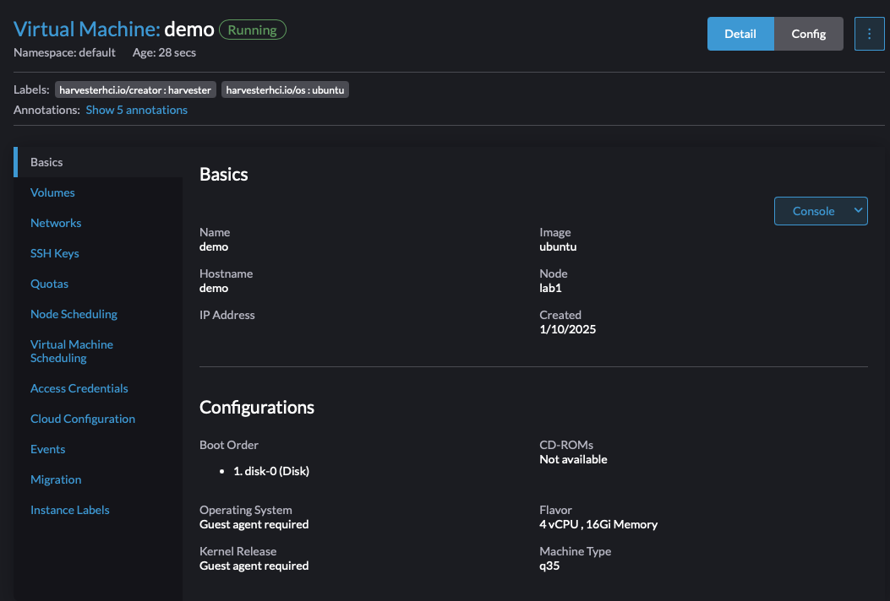

# A simple helmchart for Harvester

When we create a VM inside of Harvester's UI, we can see the resulting yaml that is generated and use that as a starting point. Here I've created a simple VM in my Lab:


I can select `Edit YAML` and then see the innards of this VM definition. I'm going to trim some things out so it isn't so large:

```console
❯ kubectl get vm demo -o yaml
apiVersion: kubevirt.io/v1
kind: VirtualMachine
metadata:
  annotations:
    harvesterhci.io/vmRunStrategy: RerunOnFailure
    harvesterhci.io/volumeClaimTemplates: '[{"metadata":{"name":"demo-disk-0-gq2mu","annotations":{"harvesterhci.io/imageId":"default/ubuntu"}},"spec":{"accessModes":["ReadWriteMany"],"resources":{"requests":{"storage":"40Gi"}},"volumeMode":"Block","storageClassName":"longhorn-ubuntu"}}]'
<snip>
  name: demo
  namespace: default
  resourceVersion: "129514482"
  uid: afce69ef-4b06-432e-9177-dab23b7caec7
spec:
  runStrategy: RerunOnFailure
  template:
<snip>
    spec:
<snip>
      architecture: amd64
      domain:
        cpu:
          cores: 4
          sockets: 1
          threads: 1
        devices:
          disks:
          - bootOrder: 1
            disk:
              bus: virtio
            name: disk-0
          - disk:
              bus: virtio
            name: cloudinitdisk
<snip>
```

Two things to note here:
* Some of the components here like cloud-init are linked to separate resources. The CRD for the `VirtualMachine` type does allow us to define cloud-init inline, but there is a size limit. So typically, we'll dump that into a `Secret` instead. Having it in a `Secret` also allows us to hide away any actual secret data like passwords or keys that we don't want an Auditor/ViewOnly role to be able to see.
* In Harvester, an annotation is used for defining the Volume that needs to be created when this VM instance is first created. While this works well from the UI perspective, if we try to clean up this VM from the CLI, it will not delete the volume mentioned in the annotation. So what I typically do is create the `PVC` seperately

### So what can we do here?

Based upon the above, we can begin to template out not only the VM instance, but also the aforementioned `Secret` to contain the cloud-init data as well as the `PVC` that will define the volume. 

If I want this VM to become an RKE2 node, I need to install RKE2 onto it. Which means those commands need to be defined inside the cloud-init secret so that the VM will install RKE2 automatically when it first starts. To do that, my cloud-init should look something like this:
```yaml
#cloud-config
write_files:
- path: /etc/rancher/rke2/config.yaml
owner: root
content: |
    token: mysharedtoken
    tls-san:
    - 86.75.30.9 # load balancer IP
runcmd:
- - systemctl
  - enable
  - --now
  - qemu-guest-agent.service
-  mkdir -p /var/lib/rancher/rke2-artifacts && wget https://get.rke2.io -O /var/lib/rancher/install.sh && chmod +x /var/lib/rancher/install.sh
- INSTALL_RKE2_VERSION=v1.29.6+rke2r1 /var/lib/rancher/install.sh
- systemctl enable rke2-server.service
- systemctl start rke2-server.service
ssh_authorized_keys: 
- my-ssh-key
```

I need to wrap that into a `Secret`! So I do like so (and I ensure the namespace matches the VM I intend to create)
```yaml
apiVersion: v1
kind: Secret
metadata:
  name: myvm-cloudinit
  namespace: default
stringData:
  userdata: |
    <cloud-init-here>
```

If we take this and template it out using Helm and tweak it for a control-plane config, it will look like [this file](helm/rke2/templates/rke2_cp_secret.yaml)

This same idea is extended to how we create the `PVC` and the `VM` using [this file](helm/rke2/templates/rke2_cp_vm.yaml). 

Note that these helm examples are assuming a replica count and looping on that to create multiple instances of each. See the [example values file](helm/rke2/values.yaml) for most options.